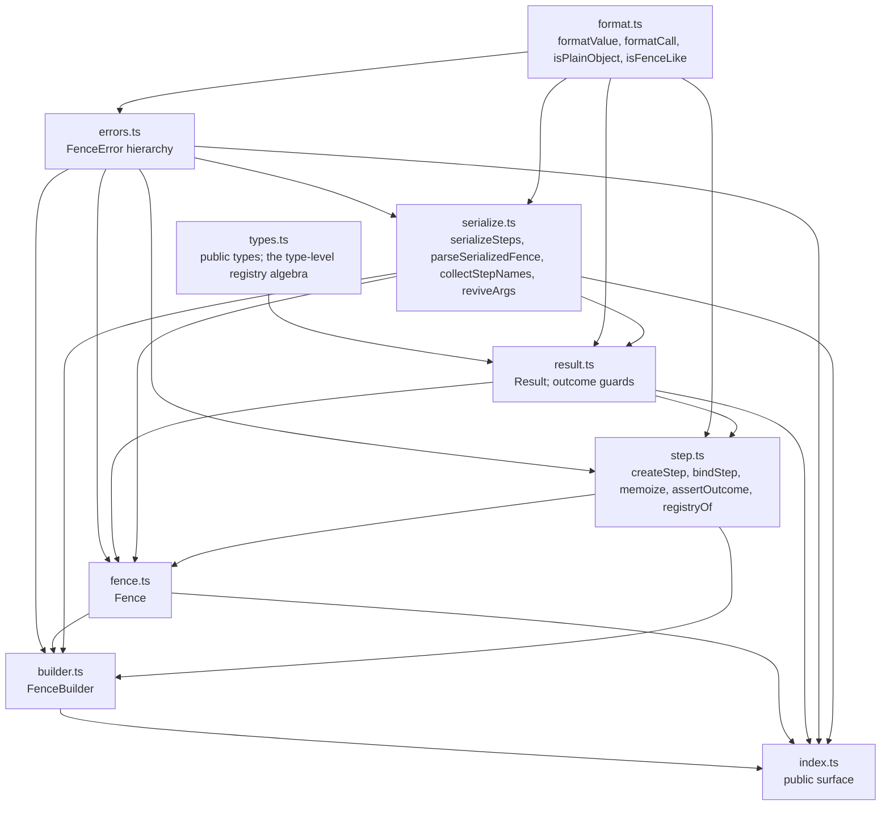

# Architecture overview

fence.js is a zero-dependency ES module of nine source files (about 1,100 lines). Its one idea:
a validation is **data** — a list of named steps and their arguments over a registry of
validators — so it can be derived, serialized, restored by name on another runtime, and run.
The design is decided in [ADR-0001](../adr/ADR-0001-immutable-registry-builder-with-inferred-types.md)
(the builder), [ADR-0003](../adr/ADR-0003-serialization-format-2.md) (the format) and
[ADR-0002](../adr/ADR-0002-esm-only-distribution.md) (distribution); the concepts are defined in the
[ontology](../toolchain/ontology.md).

## Modules



The graph is acyclic; `serialize.ts` recognizes nested fences by duck typing
(`Symbol.toStringTag === 'Fence'` plus `toJSON`) so it never imports `fence.ts`.

## The flow

```mermaid
sequenceDiagram
    participant App
    participant B as FenceBuilder
    participant F as Fence
    participant R as Result
    App->>B: create().register('min', fn).register(...)
    Note over B: registry: Map<name, {fn, options}> (immutable, shared by derived builders)
    App->>B: .required().min(4)        %% fluent = step(name, ...args)
    Note over B: steps: frozen Step[] (new array per step)
    App->>B: build()
    B->>F: new Fence(entries, steps)
    Note over F: binds each step to its validator once; memo caches live here
    App->>F: run(subject)
    F->>R: new Result(subject, [{step, value}])
    App->>R: passed / anyPassed / for(name) / failures() / explain() / toJSON()
    App->>B: JSON.stringify(builder)  → { fence: 2, steps: [...] }
    App->>B: FenceBuilder.fromJSON(json, base) → builder over base's registry
```

### Composition (`builder.ts`)

- A builder is `#entries` (a `ReadonlyMap<name, { fn, options }>`) plus `#steps` (a frozen
  array). `register` copies the map with one more entry; `step` copies the array with one more
  step; the registry object is shared between builders that have the same entries.
- Fluent methods are own, non-enumerable properties defined on each builder from a descriptor
  map cached per registry, so the prototype chain is always `FenceBuilder.prototype` and
  registering never touches a prototype.
- Names are validated at registration: non-empty, a function, not reserved (builder members,
  `Object.prototype` members, `then`, `prototype`, `__proto__`), not duplicated. The same rules
  hold at compile time through `StepName`, `Registrable` and `Mergeable`.

### Execution (`fence.ts`, `step.ts`, `result.ts`)

- `Fence` binds every step to its validator at construction (`bindStep`), wrapping memoized
  ones in a per-fence `Map`/`WeakMap` cache. `run` calls each runner and freezes each
  `{ step, value }`.
- A validator is called as a plain function with the subject and the recorded arguments; what it
  returns is checked (`assertOutcome`) and anything but a boolean, an array of `Result` or a
  record of `Result` throws `InvalidOutcomeError`. Exceptions from validators propagate.
- `Result` folds nested outcomes: `passed` needs every nested result to pass; `anyPassed` needs
  any nested step to pass; empty nested collections are vacuously passed and not anyPassed.
  `failures()` flattens with paths; `explain()` renders text; `toJSON()` is JSON-safe.

### Serialization (`serialize.ts`)

- `toJSON()` walks step arguments: JSON values pass, fences become `{ "$fence": … }`, anything
  else throws `SerializationError` (or, in the lenient mode `Result.toJSON` uses, becomes a
  description string). Cycles are detected; sparse arrays are refused.
- `fromJSON(json, base)` parses a string or object, validates the whole document including
  nested fences and every argument, collects every step name (nested included) and reports the
  unregistered ones together, then revives steps and nested fences against `base`'s entries.

## The type-level design (`types.ts`)

The registry is a type parameter `R`. `register('min', (v: string, n: number) => …)` yields
`FenceBuilder<Extend<R, 'min', F>> & StepMethods<…>`, so `.min(n: number)` exists with
autocompletion, and `step('min', 4)` is typed by name. Names are validated by conditional types
that resolve to a sentence (`'build' is reserved: …`) so the compiler error explains itself.
A non-literal name widens `R` to the plain `Registry`, and a wide registry stays wide.
`Simplify` keeps hover text flat; `Fluent<typeof base.registry>` names a builder type.

## Named invariants

The properties the code promises are named in the [ontology](../toolchain/ontology.md#named-invariants),
defined in ADR-0001 and ADR-0003, annotated in the source (`@fence:invariant(...)`) and tested:

| Invariant                     | Kept in                              | Tested in                                   |
| ----------------------------- | ------------------------------------ | ------------------------------------------- |
| `builder.immutable`           | `builder.ts` (`#make`, `step`)       | `test/builder.test.ts`                      |
| `registry.reserved-names`     | `builder.ts` (`RESERVED_NAMES`), `types.ts` (`StepName`) | `test/builder.test.ts`, `test/types.test-d.ts` |
| `validator.plain-call`        | `step.ts` (`bindStep`)               | `test/fence.test.ts`                        |
| `memo.per-fence`              | `step.ts` (`memoize`), `fence.ts`    | `test/fence.test.ts`                        |
| `result.vacuous-empty`        | `result.ts`                          | `test/result.test.ts`                       |
| `serialize.json-only`         | `serialize.ts` (`toJsonValue`)       | `test/serialize.test.ts`                    |
| `hydrate.validate-everything` | `serialize.ts`, `builder.ts` (`#hydrate`) | `test/serialize.test.ts`               |

## Distribution

ESM only, `exports` map with a `types` condition, `sideEffects: false`, `engines.node >= 20.19`,
compiled by `tsc` to `dist/` with declarations and source maps; `src/` ships for the maps.
Browsers import from an ESM CDN. No Node built-ins are used anywhere in `src/`
([ADR-0002](../adr/ADR-0002-esm-only-distribution.md)).

## Repository layout

```
src/            the library (nine modules)
test/           Vitest suites: behavior, types, property, differential, toolchain; bench/
examples/       runnable usage, compiled against dist/ in CI
tools/          gate tool, schemas, ontology and lexicon files, hooks, release helper
docs/           the documentation graph (this file is in it)
.claude/        hooks configuration, skills, subagent definitions
.github/        CI, release and docs workflows, Dependabot, CodeQL
```
