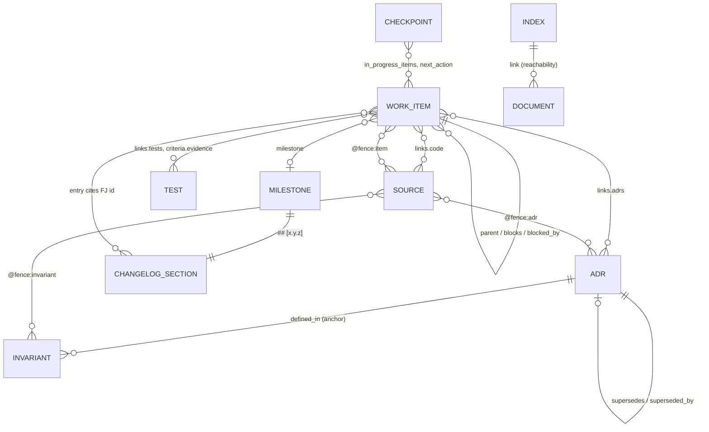

# Metamodel

The metamodel names the kinds of artifact this repository governs, what each is made of, and
how they relate. Every kind is a file with a schema; every relation is a field the gates check.
Decided in [ADR-0007](../adr/ADR-0007-vocabulary-governance.md). The classifications the fields
take are in the [taxonomy](taxonomy.md); the domain concepts the code implements are in the
[ontology](ontology.md); the words are in the [lexicon](lexicon.md).

## Kinds

| Kind             | Where                                                               | Identity       | Schema                                             | Purpose                                                               |
| ---------------- | ------------------------------------------------------------------- | -------------- | -------------------------------------------------- | --------------------------------------------------------------------- |
| Work item        | `docs/work/items/FJ-NNNN-*.md`                                      | `FJ-NNNN`      | `work-item.schema.json`                            | A unit of change with acceptance criteria and evidence                |
| Decision record  | `docs/adr/ADR-NNNN-*.md`                                            | `ADR-NNNN`     | `adr.schema.json`                                  | A decision with context, options, consequences and a status           |
| Checkpoint       | `docs/work/CHECKPOINT.md`                                           | singleton      | `checkpoint.schema.json`                           | The hand-off between sessions                                         |
| Document         | `docs/**/*.md`                                                      | path           | `doc.schema.json`                                  | Indexes, guides, toolchain and governance documents, design records   |
| Package document | `README.md`, `MIGRATING.md`, `CHANGELOG.md`, `CONTRIBUTING.md`      | path           | (Markdown; `CHANGELOG.md` by the `changelog` gate) | What ships in the npm package or greets a contributor                 |
| Milestone        | `milestone` field                                                   | semver version | —                                                  | A goal that groups items; the release a change ships in is computed   |
| Source construct | `src/**/*.ts`                                                       | path + name    | TypeScript                                         | Code; bound to decisions and invariants by annotations                |
| Invariant        | `tools/ontology.json`                                               | dotted name    | (part of the ontology)                             | A property the code promises, defined in an ADR, annotated where kept |
| Test             | `test/**/*.ts`                                                      | path           | —                                                  | Evidence for criteria and invariants                                  |
| Vocabulary file  | `tools/ontology.json`, `tools/lexicon.json`, `tools/schemas/*.json` | path           | JSON                                               | Machine mirrors the documents render from                             |

## Relations

| Relation                                               | Declared in             | Direction checked                                                        | Gate           |
| ------------------------------------------------------ | ----------------------- | ------------------------------------------------------------------------ | -------------- |
| item → item (`parent`, `blocks`, `blocked_by`)         | item front matter       | targets exist; `blocks`/`blocked_by` symmetric                           | `work-items`   |
| item → ADR / code / test / doc (`links.*`, `evidence`) | item front matter       | targets resolve; evidence required when done                             | `work-items`   |
| ADR → ADR (`supersedes`, `superseded_by`)              | ADR front matter        | ids resolve                                                              | `xref`         |
| code → ADR / item / invariant / doc (`@fence:…`)       | source comment          | kind is governed, target matches its pattern and resolves                | `binding`      |
| invariant → ADR (`defined_in`)                         | `tools/ontology.json`   | section resolves; each invariant annotated somewhere (warning otherwise) | `binding`      |
| checkpoint → item                                      | checkpoint front matter | both directions for `in-progress`; next action names open items          | `checkpoint`   |
| index → document                                       | Markdown links          | every governed document reachable                                        | `reachability` |
| commit → release                                       | commit message          | a Conventional Commit; its type decides the version bump (ADR-0013)      | `commitlint`   |

## Identity and allocation

Ids are allocated as the next number above the highest on disk (`npm run work -- new`,
`npm run adr -- new`); the file is created exclusively, so two allocations cannot silently
share an id. Ids are never reused; a cancelled item keeps its id and its file.

## What is deliberately not modeled

- **Status history** on items: git holds it (`git log --follow docs/work/items/FJ-NNNN-*.md`).
- **Feature records** separate from work items: at this size the milestone plus the changelog is
  the product plane. Revisit if the changelog stops being enough to answer "what does 2.x do".
- **Elicitations / owner questions** as records: open questions live in the checkpoint and in
  ADRs marked `proposed`.
