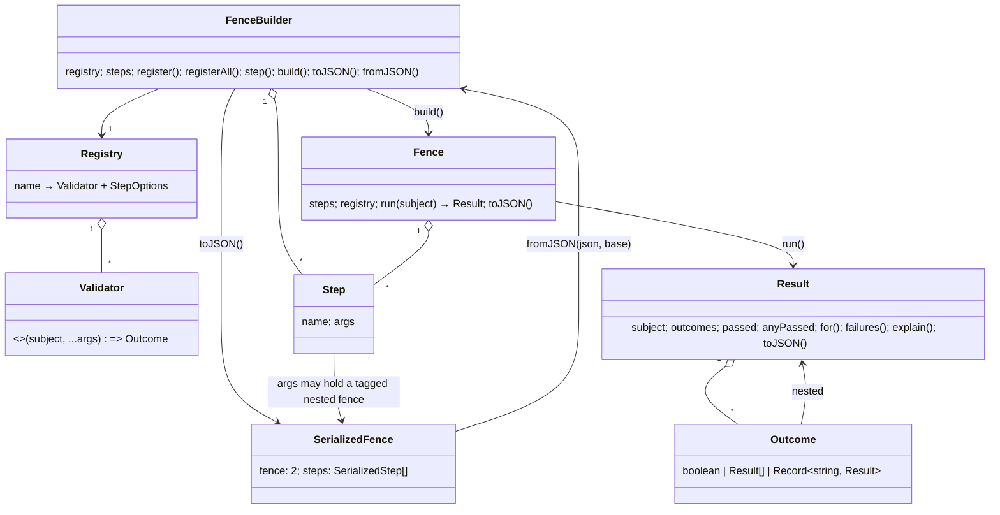

# Ontology

Two vocabularies, both governed. The first is the **domain**: what a fence is made of, in the
words the code and the documents use. The second is the **binding vocabulary** that ties source
constructs to decisions and invariants; its machine mirror is
[`tools/ontology.json`](../../tools/ontology.json), from which the tables below are rendered
(the `generated` gate keeps them equal; edit the JSON and run `npm run gates:fix`). Decided in
[ADR-0007](../adr/ADR-0007-vocabulary-governance.md).

## Domain concepts



| Concept          | Definition                                                                                                                                                                                               | In code                                       |
| ---------------- | -------------------------------------------------------------------------------------------------------------------------------------------------------------------------------------------------------- | --------------------------------------------- |
| Validator        | A function of a subject and zero or more arguments that returns an outcome. Supplied by the application; fence.js ships none.                                                                            | `Validator` in `src/types.ts`                 |
| Registry         | The validators a builder knows, by name, with their step options. Names are what serialized fences refer to.                                                                                             | `Registry`, `RegistryEntries`                 |
| Builder          | An immutable value holding a registry and recorded steps, with one fluent method per validator. Every operation returns a new builder.                                                                   | `FenceBuilder` in `src/builder.ts`            |
| Step             | A recorded `(name, args)` pair: which validator to call and with what arguments after the subject. Frozen; arguments held by reference.                                                                  | `Step`, `createStep` in `src/step.ts`         |
| Fence            | A built, immutable validation: steps bound to validators, ready to run.                                                                                                                                  | `Fence` in `src/fence.ts`                     |
| Subject          | The value a fence is run against. Any value; one per run.                                                                                                                                                | `Fence.run(subject)`                          |
| Outcome          | What a validator returns: a boolean, an array of results, or a record of results (nested outcomes).                                                                                                      | `Outcome`                                     |
| Result           | Every step paired with its outcome for one subject; verdicts (`passed`, `anyPassed`), queries, failure paths, an explanation and a JSON form.                                                            | `Result` in `src/result.ts`                   |
| Failure path     | The sequence of step names and nested keys or indices that leads to a failed step, e.g. `['policy', 'password', 'min']`.                                                                                 | `Failure`, `Result.failures()`                |
| Nested fence     | A fence passed as a step argument by a higher-order validator (a "policy"). Serialized as `{"$fence": …}`.                                                                                               | `NESTED_FENCE_KEY` in `src/serialize.ts`      |
| Wide registry    | A registry whose validator names are not known statically (a dynamic name or a `Record<string, Validator>` was registered); every fluent method then accepts any arguments, and the registry stays wide. | `IsWide`, `Extend`, `Merge` in `src/types.ts` |
| Memoization key  | The value a memoized step caches an outcome under: the subject, or `options.memoize.key(subject)`.                                                                                                       | `memoize` in `src/step.ts`                    |
| Serialized fence | The version-2 JSON document `{ fence: 2, steps }`; the portable form of a builder or fence.                                                                                                              | `SerializedFence`, `FORMAT_VERSION`           |
| Restore          | Turning a serialized fence back into a builder against a base registry (`fromJSON`). "Hydration" survives only in the error class name.                                                                  | `FenceBuilder.fromJSON`, `HydrationError`     |

## Binding vocabulary

Annotation grammar, in any source comment:

```
@fence:<kind>(<target>)
```

<!-- prettier-ignore-start -->
<!-- BEGIN GENERATED: ontology-kinds -->
| Kind | Meaning |
|---|---|
| `@fence:adr` | This construct implements or depends on a decision record; an anchor names the clause. |
| `@fence:item` | This construct is the work tracked by a work item. |
| `@fence:invariant` | This construct establishes or relies on a named invariant from the table below. |
| `@fence:doc` | Reference to a documentation section (the weakest binding; prefer a specific kind). |

A target must match its kind's pattern:

```text
adr        ^ADR-\d{4}(#[a-z0-9-]+)?$
item       ^FJ-\d{4}$
invariant  ^[a-z0-9]+(\.[a-z0-9-]+)+$
doc        ^docs/[A-Za-z0-9/._-]+\.md(#[a-z0-9-]+)?$
```
<!-- END GENERATED: ontology-kinds -->
<!-- prettier-ignore-end -->

### Named invariants

An invariant is a property the code promises. It is **defined** in a decision record (the
`defined_in` section), **kept** by the construct that carries the `@fence:invariant(...)`
annotation, and **tested** in `test/`. The `binding` gate checks that every definition resolves
and warns when an invariant is annotated nowhere.

<!-- prettier-ignore-start -->
<!-- BEGIN GENERATED: ontology-invariants -->
| Invariant | Meaning | Defined in |
|---|---|---|
| `builder.immutable` | No operation on a FenceBuilder mutates the receiver, its registry, its steps or any prototype; every operation returns a new builder. | [adr/ADR-0001-immutable-registry-builder-with-inferred-types.md#decision](../../docs/adr/ADR-0001-immutable-registry-builder-with-inferred-types.md#decision) |
| `registry.reserved-names` | A validator may not be registered under a builder member name, an Object.prototype member name, `then`, `prototype` or `__proto__`; the check runs at compile time and at run time. | [adr/ADR-0001-immutable-registry-builder-with-inferred-types.md#decision](../../docs/adr/ADR-0001-immutable-registry-builder-with-inferred-types.md#decision) |
| `validator.plain-call` | A validator is called as a plain function (`this` is undefined) with the subject followed by the recorded step arguments; exceptions it throws propagate unchanged. | [adr/ADR-0001-immutable-registry-builder-with-inferred-types.md#decision](../../docs/adr/ADR-0001-immutable-registry-builder-with-inferred-types.md#decision) |
| `memo.per-fence` | A memoization cache belongs to one built Fence, keys primitives by SameValueZero and objects by identity, and caches every outcome including false. | [adr/ADR-0001-immutable-registry-builder-with-inferred-types.md#decision](../../docs/adr/ADR-0001-immutable-registry-builder-with-inferred-types.md#decision) |
| `result.vacuous-empty` | An empty nested outcome collection counts as passed for `passed` and as not passed for `anyPassed`; explain() names it. | [adr/ADR-0001-immutable-registry-builder-with-inferred-types.md#decision](../../docs/adr/ADR-0001-immutable-registry-builder-with-inferred-types.md#decision) |
| `serialize.json-only` | Only JSON values and fences may appear in step arguments; a fence nested in an argument is tagged `{"$fence": …}`; anything else is refused when serializing (strict) or described as a string (lenient, diagnostics only). | [adr/ADR-0003-serialization-format-2.md#decision](../../docs/adr/ADR-0003-serialization-format-2.md#decision) |
| `hydrate.validate-everything` | fromJSON validates the whole document, including nested fences and every argument, and reports every unregistered validator name at once before building anything. | [adr/ADR-0003-serialization-format-2.md#decision](../../docs/adr/ADR-0003-serialization-format-2.md#decision) |
<!-- END GENERATED: ontology-invariants -->
<!-- prettier-ignore-end -->

## Direction and reciprocity

| Direction        | How it is declared                                 | Checked by                                      |
| ---------------- | -------------------------------------------------- | ----------------------------------------------- |
| code → decision  | `@fence:adr(ADR-NNNN#section)` in a source comment | `binding`: target resolves                      |
| code → invariant | `@fence:invariant(name)`                           | `binding`: name is defined; definition resolves |
| code → item      | `@fence:item(FJ-NNNN)`                             | `binding`: item exists                          |
| decision → code  | `related` paths in ADR front matter                | `xref`                                          |
| item → code      | `links.code`, `links.tests`                        | `work-items`                                    |
