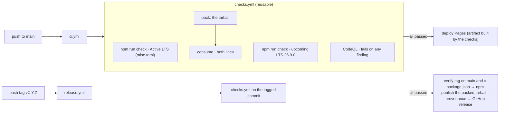

# Release process

Decided in [ADR-0008](../adr/ADR-0008-release-process.md) and
[ADR-0010](../adr/ADR-0010-one-reusable-check-workflow-gates-pages-deployment-and-npm-p.md).
Semantic versioning, Keep a Changelog, one release commit and one annotated tag on `main`,
publication by a tag-triggered workflow that waits for every check to pass and uses npm trusted
publishing. Nothing is published from a laptop, and nothing is published or deployed while any
check is failing.

## The pipeline



## Versioning

| Change                                                                      | Version part                                              |
| --------------------------------------------------------------------------- | --------------------------------------------------------- |
| Public API or serialization format change that can break a correct consumer | major                                                     |
| New capability, new export, wider input accepted                            | minor                                                     |
| Everything else: fixes, docs, dependencies, performance                     | patch                                                     |
| Not yet stable for a version                                                | `-beta.N` prerelease; published under the `next` dist-tag |

A tag that has been pushed is never moved or reused. If a tagged release fails before it is
published, the fix ships as the next patch (2.0.0 → 2.0.1).

## Steps

1. **Close the milestone.** Every work item with `milestone: x.y.z` is `done` or moved;
   `npm run gates` is green.
2. **Write the changelog section.** Move the `[Unreleased]` entries into
   `## [x.y.z] - YYYY-MM-DD`, Keep a Changelog categories only (Added · Changed · Deprecated ·
   Removed · Fixed · Security), citing work item ids. The `changelog` gate checks the shape;
   `node scripts/changelog.mjs check x.y.z` checks the section exists.
3. **Run the whole chain.** `npm run check` (CI runs exactly this).
4. **Bump, commit, tag.** On `main` with a clean tree:

   ```sh
   npm version x.y.z --no-git-tag-version
   git commit -am "Release vx.y.z"
   git tag -a vx.y.z -m "Release vx.y.z"
   ```

   `npm run release` (release-it) does the same and pushes, when the owner runs it.

5. **Publish (owner only).** `git push origin main --follow-tags`. The push runs CI on `main`
   (and deploys Pages when it passes); the tag runs `release.yml`, which runs every check on
   the tagged commit and only then publishes the tarball those checks verified under `latest`
   (or `next`) with provenance and creates the GitHub release from `node scripts/changelog.mjs notes x.y.z`. Trusted publishing
   is configured on npmjs.com for this repository, `release.yml` and the `npm` environment.
6. **Checkpoint.** Refresh `docs/work/CHECKPOINT.md`; open the next milestone.

## What ships

`npm pack` contains `dist/`, `src/`, `README.md`, `MIGRATING.md`, `CHANGELOG.md`, `LICENSE` and
`package.json`; `publint` and `attw` check the shape, and the `consume` job installs the tarball
by name on both tested Node lines.

## Maintenance lines

Releasing from an older line (`v1`) is **not supported yet**. A tag runs the workflow files of
the tagged commit: the `v1` branch has no release workflow, and the `main` one would refuse a tag
that is not on `main` and would publish under `latest`. Whether a 1.x line is released at all
is FJ-0013; if it is, it needs its own release workflow that checks ancestry against `v1` and
publishes under a `release-1.x` dist-tag.
