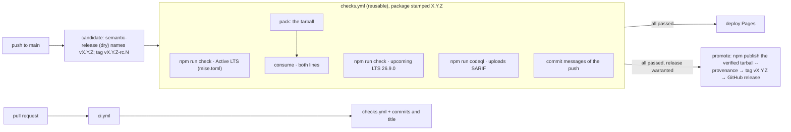

# Release process

Decided in
[ADR-0013](../adr/ADR-0013-trunk-based-continuous-release-conventional-commits-semantic.md)
(which supersedes ADR-0008) and
[ADR-0010](../adr/ADR-0010-one-reusable-check-workflow-gates-pages-deployment-and-npm-p.md).

- Trunk-based development: `main` is the only branch that releases.
- Releases are continuous and fully automated. Every push to `main` whose
  [Conventional Commits](https://www.conventionalcommits.org/en/v1.0.0/) warrant a release is
  tagged as a release candidate, checked, and promoted with no human step.
- Nothing is published from a laptop. Nothing is published or deployed while any check fails.
  Nothing is committed to `main` by the pipeline.

## The pipeline

`release.yml` runs the push-to-`main` pipeline, one run at a time; `ci.yml` runs the same checks
on pull requests.

## What a commit releases

The commit's type decides, by semantic-release's `conventionalcommits` rules:

| Commit                                                      | Release | Example                                        |
| ----------------------------------------------------------- | ------- | ---------------------------------------------- |
| `!` after the type, or a `BREAKING CHANGE:` footer          | major   | `feat!: fromJSON refuses format 1`             |
| `feat`                                                      | minor   | `feat: accept a custom message per step`       |
| `fix`, `perf`, `revert`                                     | patch   | `fix: explain() names the failing step`        |
| `build`, `chore`, `ci`, `docs`, `refactor`, `style`, `test` | nothing | `build(deps): bump the dev-dependencies group` |

The [change classes](taxonomy.md#version-change-classes) say which type a change is. A push
releases the highest bump among its commits since the last release. The notes list them under
Features, Bug Fixes, Performance Improvements, Reverts and Breaking Changes.

The same messages are checked in three places:

- the `commit-msg` hook, locally;
- `ci.yml`, for every commit of a pull request and for its title (a squash merge writes the
  title);
- `release.yml`, for the commits each push adds. A nonconforming commit fails its own run, so
  that push is not released; it blocks no later push.

## The steps, all automated

1. **Candidate** (`node tools/release/release.ts candidate`).
   - semantic-release runs dry with only the commit plugins and names X.Y.Z.
   - HEAD is tagged `vX.Y.Z-rc.N`, where N is one more than the highest candidate for X.Y.Z so
     far (a re-run reuses its tag), and the tag is pushed.
   - A push that warrants no release gets no tag. It is still checked, and its documentation is
     still deployed.
2. **Checks.** Every job of `checks.yml` runs, with X.Y.Z stamped into `package.json`, so the
   tarball packed and consumed is the one to be published. In git, `package.json` says
   `0.0.0-development`.
3. **Pages** deploys the API reference built by the checks.
4. **Promotion** (`npx semantic-release`, configured in `release.config.mjs`), once every check
   passed:
   1. verify: the version it computes must be the candidate's, and the tarball must hold it;
   2. prepare: publish that tarball to npm under `latest` with provenance, through trusted
      publishing;
   3. tag `vX.Y.Z` on the candidate's commit;
   4. create the GitHub release with the generated notes.

   If `main` has moved on meanwhile, it declines and the newer run releases.

## When something fails

| Failure                                | What is left                                                      | What happens next                                                                           |
| -------------------------------------- | ----------------------------------------------------------------- | ------------------------------------------------------------------------------------------- |
| A check fails                          | the candidate tag `vX.Y.Z-rc.N`                                   | Push a fix; its run tags `vX.Y.Z-rc.N+1` (or a higher version, if the fix warrants one)     |
| The publish fails (npm, the network)   | the candidate tag; no release tag, since publish precedes tagging | Re-run the failed job, or push again: the same version is promoted                          |
| npm has the version but the tag failed | the version on npm                                                | The next run sees the same bytes on npm, skips publishing and completes the tag and release |
| A newer push arrived during the checks | the older candidate tag                                           | The newer run promotes, including the older commits                                         |

## Owner settings the pipeline depends on

- **npm trusted publisher** for `fence.js`:
  - repository `dotcarls/fence.js`, workflow `release.yml`, environment `npm`;
  - allowed actions must include **`npm publish`**. A configuration made after 2026-09-03
    allows only `npm stage publish` by default, and npm then answers
    `403 … OIDC permission denied for this action`.
- **`main`'s ruleset** limits updates to maintainers. The pipeline never pushes to `main`; it
  pushes tags only, which the ruleset does not cover.
- **The `npm` environment** holds the publishing job. Limiting its deployment branches to `main`
  is optional hardening.

## Versioning

Semantic versioning; the commit types above map the
[change classes](taxonomy.md#version-change-classes) onto it. A version that npm has is never
reused, and a pushed release tag is never moved. `v2.0.0`, `v2.0.1` and `v2.0.2` were tagged by
hand under ADR-0008; 2.0.0 and 2.0.1 were never published. After 2.0.2 every release is the
pipeline's.

## What ships

`npm pack` contains `dist/`, `src/`, `README.md`, `MIGRATING.md`, `CHANGELOG.md` (the
hand-written record through 2.0.2), `LICENSE` and `package.json`. `publint` and `attw` check the
shape, and the `consume` job installs the tarball by name on both tested Node lines. Release
notes from 2.0.3 on are the
[GitHub releases](https://github.com/dotcarls/fence.js/releases).

## Previewing a release

`npm run release:dry-run` prints what the commits since the last release would release. It tags
nothing and publishes nothing, but it does contact the remote to check push access, as
semantic-release always does.

## Maintenance lines

Releasing from an older line (`v1`) is **not supported**: semantic-release is configured for
`main` only. Whether a 1.x line is released at all is FJ-0013. If it is, `v1` becomes a
semantic-release maintenance branch (`{ name: '1.x', range: '1.x' }`) with its own dist-tag.
