# The development lifecycle

One lifecycle, version controlled, with a gate at every transition. It is deliberately small:
a library with one maintainer and agent collaborators needs a lifecycle it can actually follow.
Decided in [ADR-0006](../adr/ADR-0006-agentic-toolchain-and-sdlc.md); the vocabulary is in the
[taxonomy](taxonomy.md).

## The unit of work is the work item

Every change beyond a typo is a **work item** (`docs/work/items/FJ-NNNN-<slug>.md`,
[work-tracking](work-tracking.md)). An item carries its **acceptance criteria**, written before
work starts, and is closed only by **evidence**: a link into the repository that proves each
criterion. Items may be grouped by **milestone**: a goal such as `2.1.0` or a line (`2.x`). The
version a change actually ships in is decided by the release pipeline from its commit type.

Decisions that shape more than one item are **decision records** (`docs/adr/`,
[ADR-0000](../adr/ADR-0000-adr-process.md)). An item links the ADRs that constrain it; code that
implements a decision is annotated ([ontology](ontology.md)).

## Statuses and transitions

```mermaid
stateDiagram-v2
    [*] --> backlog: item created
    backlog --> ready: criteria written, decisions recorded
    ready --> in_progress: picked up; named in CHECKPOINT
    in_progress --> review: every criterion satisfied with evidence
    in_progress --> blocked: blocked_by or blocked_reason set
    blocked --> in_progress
    review --> done: review found nothing blocking; check chain green
    review --> in_progress: findings to fix
    backlog --> cancelled
    ready --> cancelled
    done --> [*]
    cancelled --> [*]
```

| Transition       | What must be true (who checks)                                                                                                                                                                                                                                                                       |
| ---------------- | ---------------------------------------------------------------------------------------------------------------------------------------------------------------------------------------------------------------------------------------------------------------------------------------------------- |
| → `ready`        | Acceptance criteria are observable outcomes; every decision the item needs exists as an ADR (`proposed` is enough). Reviewer: a person or the coordinating session.                                                                                                                                  |
| → `in-progress`  | The item is listed in `docs/work/CHECKPOINT.md` (`work-items` gate).                                                                                                                                                                                                                                 |
| → `review`       | Every criterion `satisfied: true` with an `evidence` link that resolves; `npm run check` green (the pre-push hook runs it and `npm run codeql` on a clean export of the commit; CI runs both).                                                                                                       |
| → `done`         | An adversarial review (`fence-reviewer`) found nothing blocking, or the item is small enough that the coordinating session reviewed it; `blocked_by` items are done (`work-items` gate). A user-visible change reaches `main` as a `feat`, `fix` or `perf` commit whose subject is its release note. |
| commit → release | Automated: a push to `main` whose commits warrant a release is promoted once every check passes ([release-process](release-process.md)).                                                                                                                                                             |

## Definition of ready

- The title says what changes, not how.
- Each criterion is something a test, a gate, a command or a reader can check.
- The ADRs it depends on exist; if a design question is open, the item is a `decision` or `spike`
  whose deliverable is the ADR.

## Definition of done

- Every criterion is satisfied with resolving evidence: a test file, a document section
  (`path#anchor`), an ADR or item id, or a recorded command result.
- `npm run check` is green on the tree that closes it.
- User-visible changes are in `CHANGELOG.md`; documentation that the change affects is updated
  in the same commit.
- The item's `updated` date is the closing date.

## Branches and commits

- `main` is the default branch and the release line. Work happens on short-lived branches or directly on `main`
  for small, gate-clean changes; the owner decides.
- Agents commit locally at coherent boundaries with the check chain green and the co-author
  trailer, and never push, publish or rewrite shared history
  ([ADR-0006](../adr/ADR-0006-agentic-toolchain-and-sdlc.md)). Commit by explicit path when
  another session may be working the same tree.
- A commit that changes governed documents regenerates the generated blocks
  (`npm run gates:fix`) so indexes never lag.

## Releases

Releases are automated from `main` (ADR-0013). Every commit is a Conventional Commit whose type
says what it releases: a breaking change to the public API or the serialization format is a
major (`!`), new capability a minor (`feat`), a fix or a speedup a patch (`fix`, `perf`), and
everything else nothing. A push that warrants a release is tagged as a release candidate,
checked, and promoted: published with provenance, tagged `vX.Y.Z`, announced with generated
notes. The full procedure is [release-process](release-process.md).

## Sessions

A session starts by reading the checkpoint and ends by refreshing it
([checkpoint-protocol](checkpoint-protocol.md)). The `Stop` hook refuses to end a session while
the checkpoint is older than the newest tracker or ADR change.

## Roles

| Role                            | Realized by                                                                                    |
| ------------------------------- | ---------------------------------------------------------------------------------------------- |
| Owner                           | Tim Carlson: approves ADRs, accepts releases, pushes and publishes                             |
| Coordinating session            | The interactive Claude Code session: plans, commits, dispatches at most three agents at a time |
| Implementer / scribe / reviewer | `.claude/agents/` ([agents-and-skills](agents-and-skills.md))                                  |
